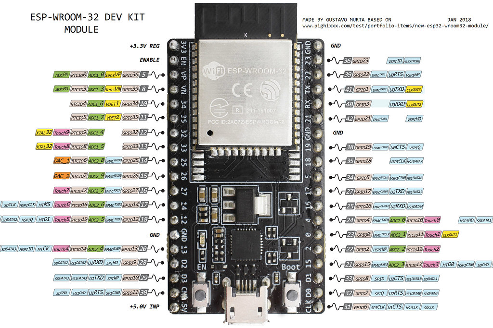

# 4. ESP32 và Lợi Ích Trong Hệ Thống Tản Nhiệt

ESP32 là một bộ vi điều khiển thuộc danh mục vi điều khiển trên chip công suất thấp và tiết kiệm chi phí. Hầu hết tất cả các biến thể ESP32 đều tích hợp Bluetooth và Wi-Fi chế độ kép, làm cho nó có tính linh hoạt cao, mạnh mẽ và đáng tin cậy cho nhiều ứng dụng.

Nó là sự kế thừa của vi điều khiển NodeMCU ESP8266 phổ biến và cung cấp hiệu suất và tính năng tốt hơn. Bộ vi điều khiển ESP32 được sản xuất bởi Espressif Systems và được sử dụng rộng rãi trong nhiều ứng dụng khác nhau như IoT, robot và tự động hóa.

ESP32 cũng được thiết kế để tiêu thụ điện năng thấp, lý tưởng cho các ứng dụng chạy bằng pin. Nó có hệ thống quản lý năng lượng cho phép nó hoạt động ở chế độ ngủ và chỉ thức dậy khi cần thiết, điều này có thể kéo dài tuổi thọ pin rất nhiều.

Với khả năng tích hợp nhiều chức năng trong một chip và khả năng kết nối mạng không dây, ESP32 mang lại nhiều lợi ích cho hệ thống tản nhiệt:

- **Thu thập dữ liệu từ cảm biến:** ESP32 có thể được sử dụng để kết nối với các cảm biến nhiệt độ, độ ẩm, áp suất và các cảm biến khác trong hệ thống tản nhiệt. Bằng cách này, nó có thể thu thập dữ liệu môi trường quan trọng để giám sát hiệu suất của hệ thống.

- **Giao tiếp không dây:** Với tích hợp WiFi và Bluetooth, ESP32 cho phép truyền dữ liệu không dây giữa hệ thống tản nhiệt và các thiết bị khác như máy tính hoặc điện thoại di động. Điều này cung cấp tính linh hoạt cao và cho phép kiểm soát hệ thống từ xa.

- **Tích hợp với Internet of Things (IoT):** ESP32 có thể hoạt động như một nút trong mạng IoT, cho phép truyền dữ liệu đến các dịch vụ điện toán đám mây hoặc máy chủ để phân tích và lập kế hoạch bảo trì cho hệ thống tản nhiệt. Điều này tạo điều kiện cho giám sát từ xa và quản lý thông minh của hệ thống.

- **Tiết kiệm năng lượng:** ESP32 được thiết kế để tiêu thụ ít năng lượng, giúp tiết kiệm năng lượng trong hệ thống tản nhiệt. Điều này đặc biệt quan trọng trong các ứng dụng di động hoặc nơi không có nguồn điện liên tục.

- **Dễ dàng tích hợp và phát triển:** ESP32 có sẵn trong nhiều board phát triển khác nhau với hỗ trợ phần mềm mạnh mẽ từ cộng đồng phát triển. Điều này giúp tạo điều kiện cho việc phát triển nhanh chóng và tích hợp ESP32 vào hệ thống tản nhiệt một cách dễ dàng.

Việc sử dụng ESP32 trong hệ thống tản nhiệt mang lại nhiều lợi ích về thu thập dữ liệu, giao tiếp không dây, tích hợp với IoT, tiết kiệm năng lượng và dễ dàng tích hợp và phát triển. Điều này giúp nâng cao hiệu suất và tính linh hoạt của hệ thống tản nhiệt và tạo ra một giải pháp thông minh và hiệu quả.
