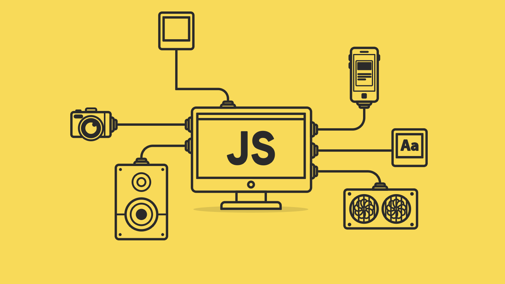

# 1. Giới thiệu ngôn ngữ lập trình JavaScript

JavaScript là một ngôn ngữ lập trình phổ biến và mạnh mẽ được sử dụng rộng rãi trong việc phát triển ứng dụng web và các ứng dụng di động. Với sự phát triển nhanh chóng từ khi ra đời vào năm 1995, JavaScript đã trở thành một trong những ngôn ngữ lập trình quan trọng nhất trong ngành công nghiệp công nghệ thông tin.

## 1.1 Lịch sử

JavaScript ban đầu được tạo ra bởi Brendan Eich của Netscape với mục tiêu là làm cho các trang web trở nên động đặc hơn. Tuy nhiên, sau đó, JavaScript đã phát triển thành một ngôn ngữ lập trình mạnh mẽ cho cả phía máy chủ và phía người dùng.

## 1.2 Đặc điểm
JavaScript là một ngôn ngữ lập trình dựa trên văn bản, linh hoạt và dễ học. Dưới đây là một số đặc điểm chính của JavaScript:

- **Dễ dàng tích hợp:** JavaScript có thể được nhúng trực tiếp vào mã HTML, giúp việc tạo ra các trang web tương tác dễ dàng hơn.

- **Đa nền tảng:** JavaScript có thể chạy trên mọi nền tảng và trình duyệt, làm cho nó trở thành một ngôn ngữ lập trình đa năng.

- **Kiểu dữ liệu động:** JavaScript sử dụng kiểu dữ liệu động, nghĩa là không cần phải khai báo kiểu dữ liệu cho biến trước khi sử dụng.

- **Hỗ trợ đối tượng:** JavaScript hỗ trợ lập trình hướng đối tượng, cho phép tạo ra các đối tượng, phương thức và thuộc tính.

- **Cú pháp gần giống với C và Java:** Người dùng có kinh nghiệm với C và Java sẽ dễ dàng học JavaScript vì cú pháp của nó khá giống.

**Cộng đồng lớn và mạnh mẽ:** JavaScript có một cộng đồng phát triển mạnh mẽ, với hàng nghìn thư viện mã nguồn mở và tài liệu hướng dẫn phong phú.

## 1.3 Ứng dụng
JavaScript đã trở thành một phần không thể thiếu của việc phát triển web và ứng dụng di động. Dưới đây là một số ứng dụng phổ biến của JavaScript:

- **Phát triển web động:** JavaScript cho phép tạo ra các trang web động, tương tác với người dùng mà không cần tải lại trang.

- **Phát triển ứng dụng di động:** Cùng với các framework như React Native và Ionic, JavaScript được sử dụng để phát triển ứng dụng di động đa nền tảng.

- **Phát triển game trình duyệt:** JavaScript có thể được sử dụng để phát triển các trò chơi trực tuyến trên trình duyệt.

- **Phát triển ứng dụng máy chủ:** JavaScript cũng có thể được sử dụng để phát triển các ứng dụng máy chủ thông qua Node.js.

Với sự linh hoạt, mạnh mẽ và sự phổ biến, JavaScript không chỉ là một công cụ quan trọng cho những nhà phát triển web, mà còn là một ngôn ngữ lập trình quan trọng trong ngành công nghiệp công nghệ thông tin toàn cầu.